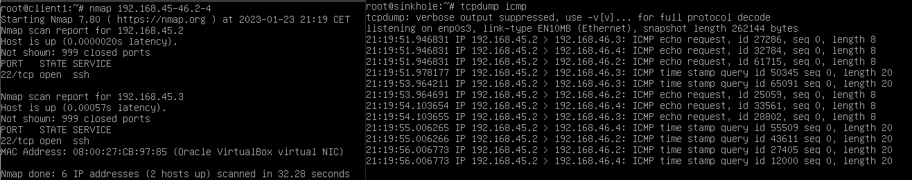

# Démonstration

Lorsqu'un attaquant va avoir accès à une machine au sein d'un réseau (d'entreprise par exemple), il voudra tenter de faire des mouvements latéraux (c'est à dire découvrir de nouveau réseaux) afin de trouver de potentielles machines sensibles et potentiellement intéressantes pour lui.

Un outil très connu pour faire cela est **nmap**. Nous allons prendre cet outil comme exemple afin de voir si notre Sinkhole fonctionne bien.
Nous allons faire en sorte de scanner les machines ayant les adresses IP 192.168.45-46.2-4. Notre Sinkhole devrait recevoir les requêtes à destination des machines ayant des adresses IP comprises entre 192.168.46.2 et 192.168.46.4.

Voici ce que nous obtenons : 

Nous voyons bien *(en zoomant)* à droite que notre sinkhole a reçu les requêtes étant à destination des adresses IP privées n'appartenant pas au réseau 192.168.45.0/24. 