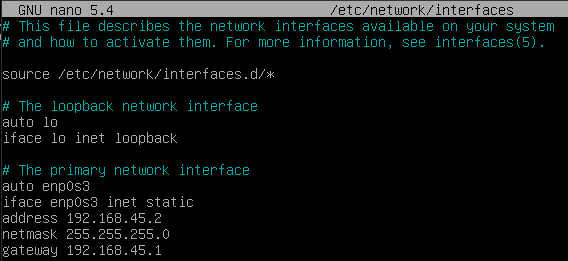
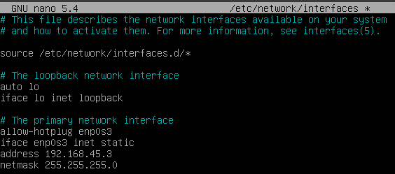

# Mise en place

## Les Machines Virtuelles

Nous avons choisi d'utiliser 3 machines virtuelles très basiques : une debian sans interface graphique avec un port 22 ouvert pour les connexions ssh depuis notre machine hôte afin de pouvoir utiliser notre terminal par défaut.

## Mise en réseau

Pour configurer les interfaces réseau sur nos machines debian, nous utilisons le fichier ```/etc/network/interfaces```

### client 1 : 

Voici le fichier ```/etc/network/interfaces``` de notre machine client1 :



### sinkhole : 

Voici le fichier ```/etc/network/interfaces``` de notre machine sinkhole :




### frontal : 

Voici le fichier ```/etc/network/interfaces``` de notre machine frontal :

