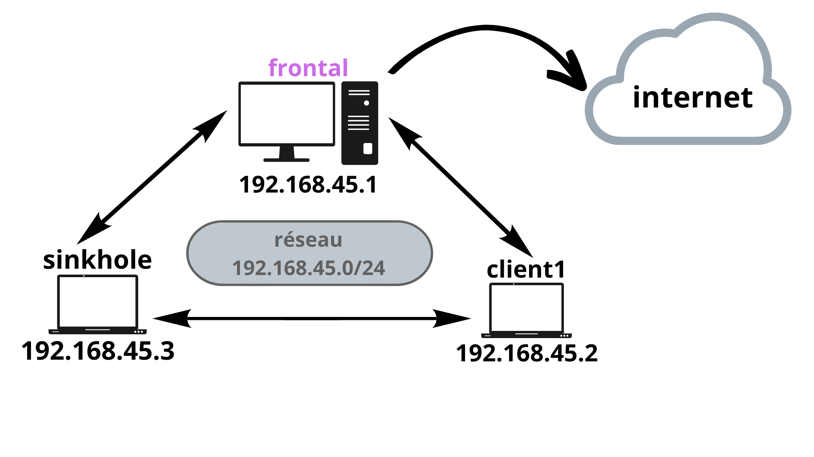

# Sinkhole IP : Explications

## Objectifs

-   Repérer les requêtes sur le réseau qui partent à destination d’autres réseaux privés (dont la machine source ne fait pas partie)
    
-   Repérer les requêtes à destination des 3 réseaux privés existants : 
    

	-   10.0.0.0/8
	    
	-   172.16.0.0/12
	    
	-   192.168.0.0/16
    

-   Envoyer les requêtes repérées à notre machine Sinkhole

## Organisation du réseau

Comme vous le voyez ci-dessus, nous aurons 3 Machines virtuelles : 

- **client1** : qui va lancer des scans réseaux pour potentiellement tenter de découvrir des machines sur des réseaux parallèles

- **frontal** : qui fait le lien entre les clients du réseau et internet (toutes les requêtes à destination d'une autre plage IP que celle des machines (192.168.45.0/24) passeront par frontal).

- **sinkhole** : notre machine sinkhole qui recevra toutes les requêtes envoyées par frontal si elles sont détectées comme allant vers d'autres réseau privés. Sinkhole ne redirigera pas les requêtes, on veut que ces dernières n'envoient aucune réponse à la machine attaquante (dans notre cas client1)